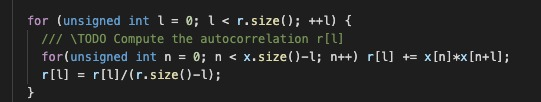
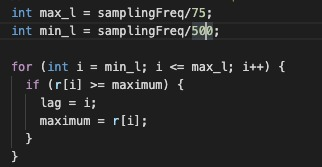
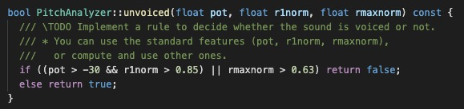
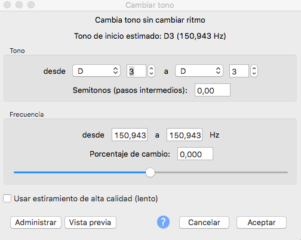
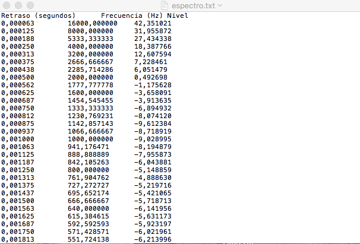
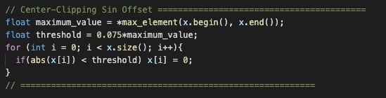
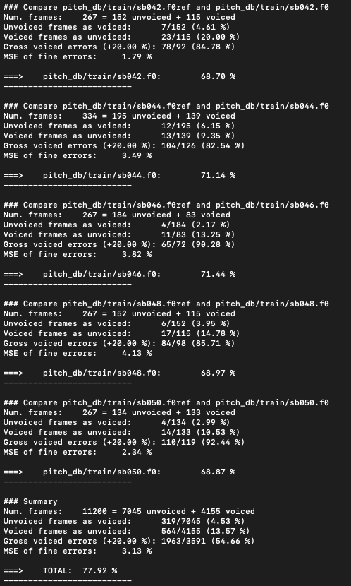

PAV - P3: detección de pitch
============================

Esta práctica se distribuye a través del repositorio GitHub [Práctica 3](https://github.com/albino-pav/P3).
Siga las instrucciones de la [Práctica 2](https://github.com/albino-pav/P2) para realizar un `fork` de la
misma y distribuir copias locales (*clones*) del mismo a los distintos integrantes del grupo de prácticas.

Recuerde realizar el *pull request* al repositorio original una vez completada la práctica.

Ejercicios básicos
------------------

- Complete el código de los ficheros necesarios para realizar la detección de pitch usando el programa
  `get_pitch`.

   * Complete el cálculo de la autocorrelación e inserte a continuación el código correspondiente.
   
   Para el cálculo de la autocorrelación lo hacemos de la siguiente manera:
   
   
   

   * Inserte una gŕafica donde, en un *subplot*, se vea con claridad la señal temporal de un sonido sonoro
     y su periodo de pitch; y, en otro *subplot*, se vea con claridad la autocorrelación de la señal y la
	 posición del primer máximo secundario.

	 NOTA: es más que probable que tenga que usar Python, Octave/MATLAB u otro programa semejante para
	 hacerlo. Se valorará la utilización de la librería matplotlib de Python.

   * Determine el mejor candidato para el periodo de pitch localizando el primer máximo secundario de la
     autocorrelación. Inserte a continuación el código correspondiente.
     
     Para calcular el segundo pico de la autocorrelación, nos definimos unos límites en los cuales buscar el máximo en la
     función de autocorrelación. Para definir esos límites usamos la frecuencia de muestreo, que sabemos que estará
     íntimamente relacionada con la posición en la que se encontrará este segundo máximo. Tenemos en los apuntes que el pitch
     humano oscila entre 75 - 500 Hz, así nos definimos las k’s entre las que se encontrará nuestro máximo (fm/75 - fm/500).
     Hemos probado distintos valores y más o menos conseguimos un valor final parecido.
     
     

   * Implemente la regla de decisión sonoro o sordo e inserte el código correspondiente.
   
   Para determinar estos límites, hemos observado algunas señales para tomar como referencia sus valores y a partir de ahí
   hemos jugado un poco con qué valores nos proporcionaban una mejor puntuación final y cuáles no. Para acabar esta parte, nos
   hemos quedado con los que nos daban mejor puntuación que son los que se pueden ver en la siguiente captura:
   
   
   

- Una vez completados los puntos anteriores, dispondrá de una primera versión del detector de pitch. El 
  resto del trabajo consiste, básicamente, en obtener las mejores prestaciones posibles con él.

  * Utilice el programa `wavesurfer` para analizar las condiciones apropiadas para determinar si un
    segmento es sonoro o sordo. 
	
	  - Inserte una gráfica con la detección de pitch incorporada a `wavesurfer` y, junto a ella, los 
	    principales candidatos para determinar la sonoridad de la voz: el nivel de potencia de la señal
		(r[0]), la autocorrelación normalizada de uno (r1norm = r[1] / r[0]) y el valor de la
		autocorrelación en su máximo secundario (rmaxnorm = r[lag] / r[0]).
		
	En nuestro caso al ser usuarios de MAC los dos, no tenemos wavesurfer sino que usamos el audacity. Seguimos teniendo
	problemas con este programa ya que así como en wavesurfer al crear una nueva pista, el programa te presenta la opción
	de mostrar el contorno de pitch, en audacity no hemos visto en ninguno de los sitios que hemos consultado que esto
	exista ya que no lo utilizan. En el caso de este programa en referencia al pitch tenemos un apartado en la sección de
	efectos que nos permite cambiar el pitch, y ahí podemos ver el pitch actual que tenemos, que como se puede ver en la
	siguiente captura es de unos 150Hz:
	
	
	
	Para la correlación, si que hemos podido encontrar la gráfica, y además podemos exportar los valores a un fichero .txt
	del que también adjuntamos captura. Gracias a esto podemos tener los valores más importantes que eran los que
	necesitabamos.
	
	
	
	
	
	
		Puede considerar, también, la conveniencia de usar la tasa de cruces por cero.

	    Recuerde configurar los paneles de datos para que el desplazamiento de ventana sea el adecuado, que
		en esta práctica es de 15 ms.
		

      - Use el detector de pitch implementado en el programa `wavesurfer` en una señal de prueba y compare
	    su resultado con el obtenido por la mejor versión de su propio sistema.  Inserte una gráfica
		ilustrativa del resultado de ambos detectores.
  
  * Optimice los parámetros de su sistema de detección de pitch e inserte una tabla con las tasas de error
    y el *score* TOTAL proporcionados por `pitch_evaluate` en la evaluación de la base de datos `pitch_db/train`..
    
    Para intentar mejorar la puntuación, además de optimizar los valores que utilizabamos en las funciones como límites entre
    otros, hemos intentado hacer muchas cosas, de las cuales pocas han salido bien. Hemos intentado varios fistros pasos bajo:
    desde intentar implementar uno con MATLAB y filterDesginer y luego convolucionar, a implementarlo por definición (según
    una definición rara de wikipedia). También hemos intentado un filtro que parecía bueno, pero solo lo parecía, mediante la
    transformada de Fourier. Después de descubrir que con los filtros paso bajo no llegabamos a buen puerto y que todos
    empeoraban el resultado final al ser aplicados, dejamos esos fistros y nos pusimos con el center-clipping. 
    
    Con el center-clipping tuvimos algo más de suerte. Probamos ambos: con y sin offset. Finalmente, obtuvimos mejor resultado
    con el sin offset y es el que dejamos implementado como se puede ver en la siguiente captura:
    
    
    
    Finalmente nuestro resultado con el código final es el siguiente:
    
    
    
    Consideramos que un 77,92% es un resultado óptimo.
	

   * Inserte una gráfica en la que se vea con claridad el resultado de su detector de pitch junto al del
     detector de Wavesurfer. Aunque puede usarse Wavesurfer para obtener la representación, se valorará
	 el uso de alternativas de mayor calidad (particularmente Python).
   

Ejercicios de ampliación
------------------------

- Usando la librería `docopt_cpp`, modifique el fichero `get_pitch.cpp` para incorporar los parámetros del
  detector a los argumentos de la línea de comandos.
  
  Esta técnica le resultará especialmente útil para optimizar los parámetros del detector. Recuerde que
  una parte importante de la evaluación recaerá en el resultado obtenido en la detección de pitch en la
  base de datos.

  * Inserte un *pantallazo* en el que se vea el mensaje de ayuda del programa y un ejemplo de utilización
    con los argumentos añadidos.

- Implemente las técnicas que considere oportunas para optimizar las prestaciones del sistema de detección
  de pitch.

  Entre las posibles mejoras, puede escoger una o más de las siguientes:

  * Técnicas de preprocesado: filtrado paso bajo, *center clipping*, etc.
  * Técnicas de postprocesado: filtro de mediana, *dynamic time warping*, etc.
  * Métodos alternativos a la autocorrelación: procesado cepstral, *average magnitude difference function*
    (AMDF), etc.
  * Optimización **demostrable** de los parámetros que gobiernan el detector, en concreto, de los que
    gobiernan la decisión sonoro/sordo.
  * Cualquier otra técnica que se le pueda ocurrir o encuentre en la literatura.

  Encontrará más información acerca de estas técnicas en las [Transparencias del Curso](https://atenea.upc.edu/pluginfile.php/2908770/mod_resource/content/3/2b_PS Techniques.pdf)
  y en [Spoken Language Processing](https://discovery.upc.edu/iii/encore/record/C__Rb1233593?lang=cat).
  También encontrará más información en los anexos del enunciado de esta práctica.

  Incluya, a continuación, una explicación de las técnicas incorporadas al detector. Se valorará la
  inclusión de gráficas, tablas, código o cualquier otra cosa que ayude a comprender el trabajo realizado.

  También se valorará la realización de un estudio de los parámetros involucrados. Por ejemplo, si se opta
  por implementar el filtro de mediana, se valorará el análisis de los resultados obtenidos en función de
  la longitud del filtro.
   

Evaluación *ciega* del detector
-------------------------------

Antes de realizar el *pull request* debe asegurarse de que su repositorio contiene los ficheros necesarios
para compilar los programas correctamente ejecutando `make release`.

Con los ejecutables construidos de esta manera, los profesores de la asignatura procederán a evaluar el
detector con la parte de test de la base de datos (desconocida para los alumnos). Una parte importante de
la nota de la práctica recaerá en el resultado de esta evaluación.
